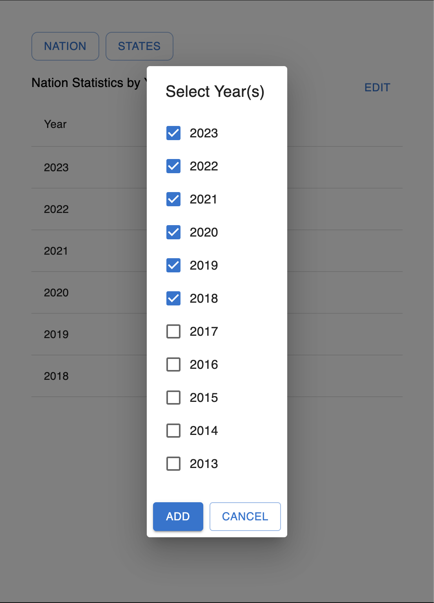
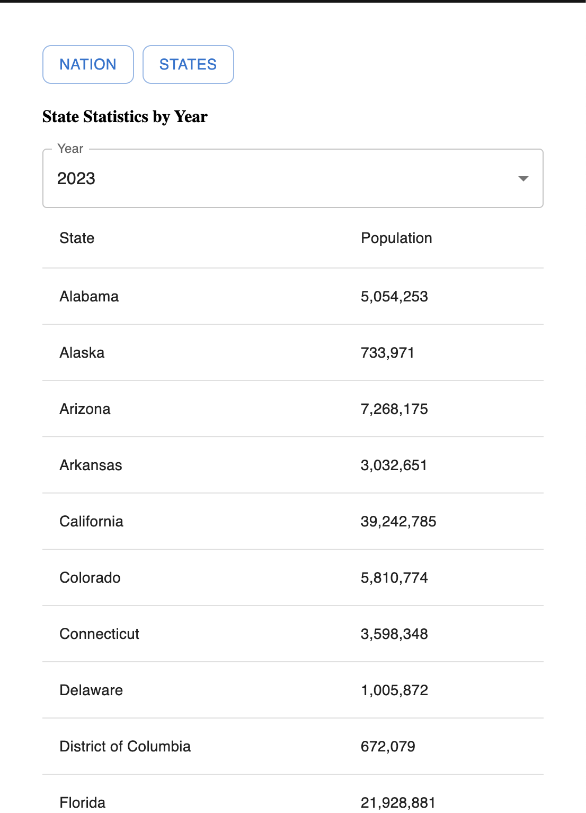

# 📊 Population Data Explorer

## 🚀 Instructions

Using [`https://datausa.io/about/api/`](https://datausa.io/about/api/), follow the directions below and create a few pages to show the user Census data. At the end, you should have two pages (Nation and States) that each display Census data at differents levels.

1. **Component Rendering**  
   - Use `routes.js` to render the available components dynamically

2. **National Population Page**  
   - Display the population for the entire nation using a list
      - Columns should be "Year" and "Population"
   - The list should initially show the **5 most recent years** along with their populations
   - The user should have an option to edit their list and customize which years are visible using a modal, checkboxes, and submit

3. **State Population Page**  
   - Display a table showing each state with its corresponding population
      - Columns should be "State" and "Population"
      - The table should initially show the census data for the most recent year
   - Using a select dropdown, allow the user to choose a year of census data
      - The dropdown should only have years with corresponding census data
      - These options should be **dynamically generated** and not hardcoded
   - Add the ability to sort by Population (ascending, descending, and unsorted)

   
**BONUS**:
   - Format population numbers with commas at each thousandths place (e.g., `1,000,000`)
   - Add the ability to sort by Population (ascending, descending, and unsorted)
   - Style the navigation hyperlinks to appear as MUI Buttons side-by-side
---
## 📌 Guidelines

- You **may** consult documentation (e.g., React Router, MDN, MUI, API).
- You **may not**:
  - Use **autocomplete** features in CodeSandbox.
  - Use any external sites outside of the docs listed below

---

## 📡 API Reference

> **MDN**: [`https://developer.mozilla.org/en-US/`](https://developer.mozilla.org/en-US/)

> **Base URL**: [`https://datausa.io/about/api/`](https://datausa.io/about/api/)

> **React Router**: [`https://v5.reactrouter.com/web/api/`](https://v5.reactrouter.com/web/api/)

> **MUI**: [`https://mui.com/material-ui/getting-started/`](https://mui.com/material-ui/getting-started/)

### Nation Edit

### States

